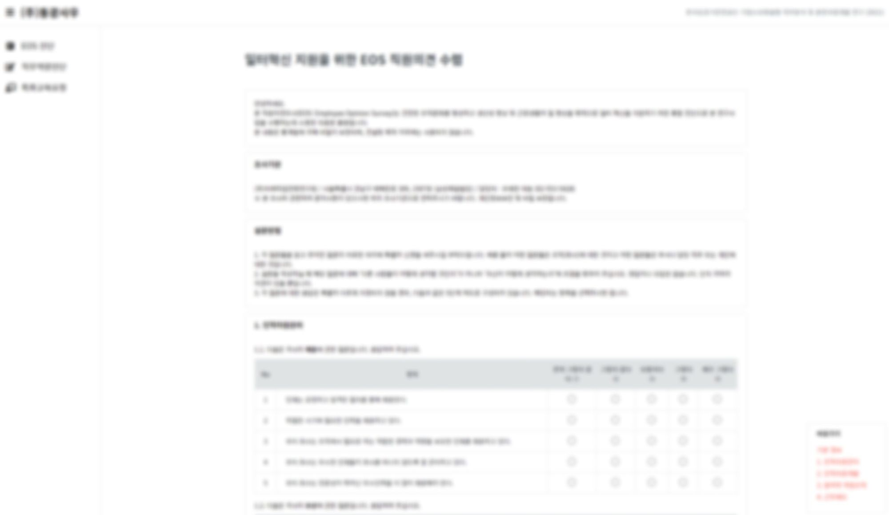

# HR Platform

## 개요

* 기간 : 2021년 4월 1일 \~ 2021년 6월 30일
* 회사 : 미래직업전망연구원
* 담당 범위 : 전체 (Backend, Frontend, Infrastructure)

## 주요 기술 스택

### Frontend

* Bootstrap + jQuery 기반으로 반응형 설계

### Backend & Infrastructure

* PHP CodeIgniter 3 (PHP 7.4)
* MariaDB 10.4 (AWS RDS)
* AWS EC2 (Linux Debian, Apache, php-fpm)

### Etc.

* Github에서 버전 관리
* 소스 커밋시 Jenkins를 통해 EC2 서버에 자동 배포

## 상세 개발 내용

<figure><figcaption>
설문 화면 캡쳐(보안 상의 이유로 블러 처리했습니다)
</figcaption></figure>

* 이용자 페이지 전체 개발 (프론트 & 백엔드 & DB)
* 관리자 페이지 전체 개발 (프론트 & 백엔드 & DB)

다른 팀의 업무 중 직무분석을 통해 적합한 교육과정을 개발하는 연구용역을 수주하여 수행하는 업무가 있습니다. 비록 다른 팀이긴 하지만 각자 어떤 일을 하고 있는지 업무 공유가 원활히 이뤄져 애로사항을 알고 있었습니다. 직무분석을 위한 기초 설문조사를 받는데, 기존 업무 프로세스는 엑셀이나 워드 파일을 보내서 응답을 기재해서 다시 회신받고, 회신받은 파일을 하나씩 수기로 엑셀에 정리하는 방식으로 되어 있었습니다.

이를 듣고 제가 먼저 플랫폼으로 만들어보자고 제안하였고, 양식을 받아서 개발을 진행했습니다.

핵심 개발은 3주정도 소요되었으나, 여러 요구사항에 대응하고 기능들이 조금씩 추가되면서 2\~3달 가량 다른 프로젝트와 병행하며 프로젝트를 마무리했습니다.

실제로 이후 어느 정도 작업량이 줄었냐는 질문에 데이터를 분류하고 정리하는 프로세스의 경우 90% 이상 단축되었다는 답을 들었습니다.

## 성장

기존 업무 프로세스의 비효율성을 개선하기 위해 직접 프로젝트를 제안하였고, 받아들여져 저의 주도로 실제 업무효율 개선을 이뤄낼 수 있어서 좋은 경험이 된 것 같습니다.
