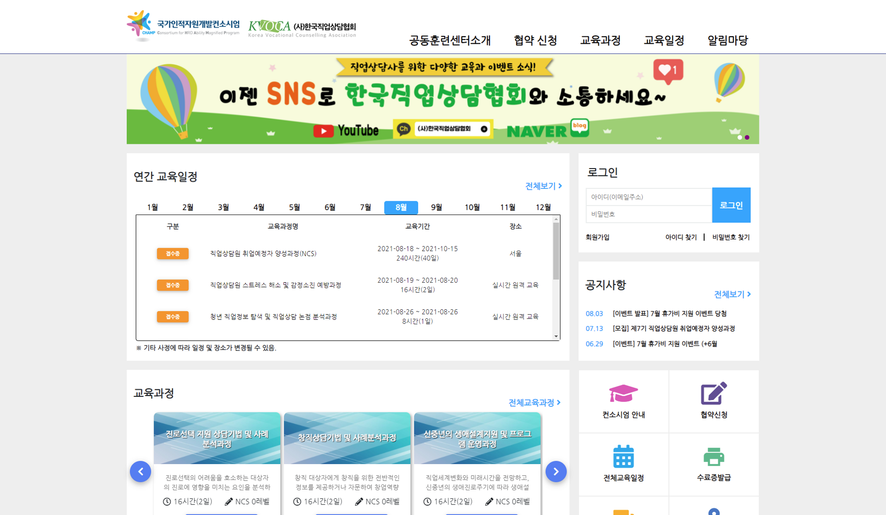

# (사)한국직업상담협회 공동훈련센터

## 개요


hrd.kvoca.org


* 기간 : 2019년 11월 1일 \~ 2020년 4월 30일
* 회사 : 미래직업전망연구원
* 담당 범위 : 전체 (Backend, Frontend, Infrastructure)

## 주요 기술 스택

### Frontend

* HTML5 + CSS3
* Bootstrap + jQuery

### Backend & Infrastructure

* Legacy PHP (PHP 7.0)
* MySQL 5.7
* 카페24 호스팅 환경에서 개발 & 운영

## 상세 개발 내용

메인 페이지 전체 및 어드민 페이지 전체 (프론트엔드, 백엔드, DB)

<figure><figcaption>
메인 페이지
</figcaption></figure>

Adobe XD로 만들어진 기획(SB)을 바탕으로 구현하였습니다. 프론트 개발시에는 기존에 만들어져있는 템플릿을 사용하지 않고 모든 부분을 직접 개발하였습니다. 화면의 각 구성요소를 중심으로 먼저 HTML 구조를 잡고, CSS로 기획서와 동일하게 잡아갔습니다. 백엔드로는 레거시 PHP를 사용했으며 7.0 버전에 대응되도록 하였습니다.

현재는 하자보수 기간 종료, 유지보수 계약 만료로 인해 다른 업체로 유지보수가 넘어간 관계로 어드민 페이지는 캡쳐를 못 했습니다.

<figure><figcaption>
교육신청 리스트 페이지
</figcaption></figure>

<figure><figcaption>
교육과정 상세 페이지
</figcaption></figure>

## 성장

* 첫 프로젝트로 백엔드 개발은 무리 없이 진행했으나, HTML과 CSS, JS의 기초지식이 부족해 퍼블리싱 및 프론트엔드 개발에 어려움이 있었습니다. 이에 제가 먼저 회사에 교육비 지원을 요청해서 하루정도 퍼블리싱 기초 교육을 받고 왔습니다. 이후 2주정도 CSS와 jQuery쪽 추가 스터디를 하며 실제 프로젝트에 사용할 수 있을 정도까지 실력을 끌어올렸습니다.
* 기획서와 스토리보드 바탕으로 요구사항을 구현하는 경험을 갖게 되었습니다.
* 주도적으로 일정을 관리하고 작업 진척사항을 공유하며 일정 계획 관리 요령을 습득할 수 있었습니다.
