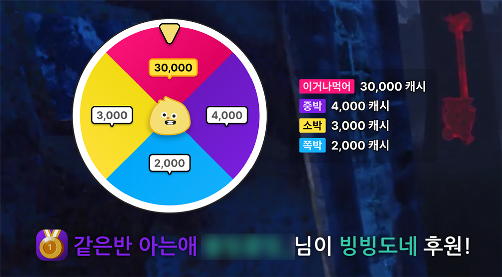

# TWIP 빙빙도네

## 개요


출시 공지


<figure><figcaption>
빙빙도네 후원 장면 캡쳐
</figcaption></figure>


빙빙도네 잭팟 이벤트


시청자가 돌림판 항목을 정해 후원을 보내면 스트리머가 돌림판에서 당첨된 금액만큼 받아가는 신규 후원 '빙빙도네'

* 기간 : 2023년 4월 \~ 2023년 6월
* 회사 : 이제이엔
* 담당 범위 : 백엔드 전체 (스트리머 대시보드, 시청자 후원 API, 위젯 웹소켓)

## 주요 기술 스택

* NestJS
* Sequelize
* MySQL, Redis
* socket.io
* CodeIgniter 3

## 상세 개발 과정

회사 로드맵에 따라 신규 후원기능 프로젝트에 백엔드 개발자로 투입되어 백엔드 전체를 담당했습니다.

초기 기획 단계부터 프로젝트의 성공을 위해 기술적인 부분과 고객 관점에서의 의견 제시, 아이디어 제시를 많이 했습니다. 그렇게 기획 리뷰 -> 디자인 리뷰 -> 개발 -> QA 과정을 거쳐 2개월 가량만에 신규 후원기능을 출시했습니다.

백엔드에서는 기존 후원시스템 대비 프로세스가 복잡하여 체계적인 설계가 필요했으며, 설계 단계부터 문서화를 진행하여 개발 과정에 포함되어있던 대부분의 기술적인 내용이 컨플루언스 문서로 남게 되었습니다. 이 덕분에 추후 트러블슈팅 상황에서 도움을 많이 받았고 인수인계도 원활히 이루어질 수 있었습니다.

사내 기술스택에 맞춰 기존 레포에 NestJS 기반으로 필요한 API를 개발했습니다. 특히 후원 API의 경우 검증 로직과 후원 과정을 분리하였고, 트랜잭션을 적절히 적용하여 안정적인 후원 과정이 이뤄지도록 했습니다. 이외 크론성 작업은 Redis Lock을 이용하여 여러 대의 파드로 구동되는 상황에서도 한 대에서만 로직이 동작하도록 중복 방어를 수행했습니다.

스트리머 대시보드의 경우 레거시(PHP) 위에서 작업해야해서 FE 리소스 없이 제가 Bootstrap + jQuery 기반으로 프론트 작업, 백엔드 작업을 함께 진행했습니다. 이외 오버레이(위젯)에서 연결되는 소켓 서버쪽 코드까지 작성했습니다.

현재는 후원 페이지 코드가 신규로 완전히 개편되었는데, 개발 당시에는 레거시/신규가 공존하던 상황이라서 PHP와 NestJS 코드 간 동일한 Redis cache를 공유하며 여러 문제가 발생하였습니다. 가령 PHP와 JS가 JSON을 다루는 방식이 달라서 Redis에 저장되는 Cache Value가 노드 환경에서 이상하게 인식되는 문제가 있었는데, 이는 신규 캐시 키를 v2로 분리하고, 레거시/신규 각각의 invalidate 코드에 v2도 함께 invalidate하는 방식으로 대응했습니다.

## 성과

* 출시 5개월만에 누적 후원액 2억원을 달성했습니다.
* 출시 이전 체계적인 구조 설계와 꼼꼼한 QA 덕분에 출시 이후 장애나 중대한 버그가 발생하지 않았습니다.
* 모바일 프로덕트팀 소속때는 iOS/AOS 개발자와 커뮤니케이션을 했는데, 이번에 처음으로 FE 개발자와 함께 프로젝트에서 호흡을 맞춰보게 되었습니다. 이전에 TWIP VOD\&CLIP과 TWIP CLIP 작업을 하면서 프로덕션 레벨에서 FE를 다뤄봐서 그런지 커뮤니케이션이 수월했고 큰 문제 없이 개발을 마쳤습니다.
