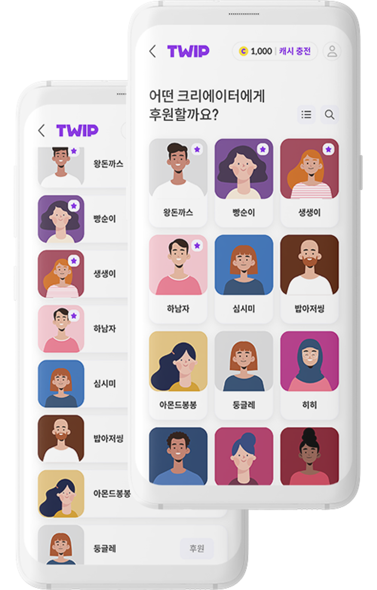
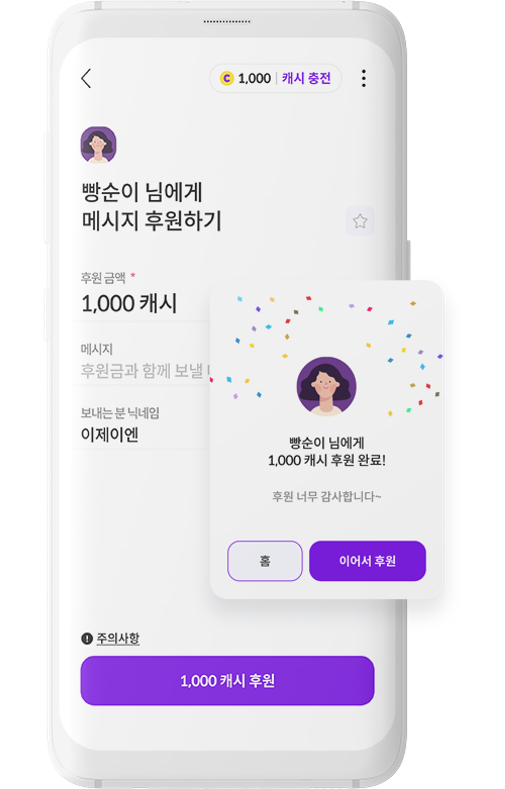

# TWIP/TGD APP

## 개요


출시 공지


안드로이드 '트게더' 앱 내에서 TWIP 후원이 가능하도록 하는 프로젝트

* 기간 : 2022년 5월 \~ 2022년 12월
* 회사 : 이제이엔
* 담당 범위 : 백엔드 전체

## 주요 기술 스택

* NestJS
* MySQL / Redis
* Swagger UI
* PHP CodeIgniter 3

## 상세 개발 과정

### 모바일 프로덕트팀 합류

모바일 프로덕트팀 소속 전임 백엔드분 퇴사로 어쩌다보니 입사 2개월차에 바로 프로젝트를 맡아서 진행하게 되었습니다. 원래 입사 초기에는 Node.js쪽 숙련도가 낮아 레거시 PHP 위주로 유지보수성 작업들을 하며 코드에 익숙해지고, 차차 NestJS쪽에도 익숙해져가며 신규 프로젝트에도 투입될 것을 기대했는데, 어쩌다보니 빠르게 프로젝트에 투입되었습니다.

이제는 더이상 레거시에 신규 기능을 추가하고 있지 않았기 때문에 신규 NestJS API에 기능들을 붙여야했고, 준비가 많이 되지 않은 상황이었지만 빠르게 개인시간에도 공부를 해가며 NestJS에 익숙해졌습니다. 이 때문에 프로젝트 초반에 백엔드 일정에 다소 지연이 생겼고, 첫 스프린트에는 일부 기능을 PHP로 구현했습니다. 하지만 그 이후에는 백엔드로 인해 일정이 지연된 경우가 거의 없었고, 모든 기능을 신규 코드베이스 위에 만들면서 성공적으로 팀에 온보딩을 마쳤습니다.

### 프로젝트 진행

팀 구성은 Product Manager 1명, Product Designer 1명, Android/iOS 개발자 각 1명, 그리고 Backend 개발자 1명으로 총 5명으로 구성되었습니다.

Agile 방법론에 따라 3주 단위의 스프린트를 진행하고, 매일 스탠드업 미팅, 매주 화요일에 위클리 미팅, 매 스프린트가 마치면 회고미팅을 하는 등 빠른 주기로 개발사이클을 가져가고자 노력했습니다.

주로 이번 스프린트에 개발할 큰 아이템이 정해지면 기획/디자인 진행, 디자인 리뷰를 거치며 필요한 API와 화면 기능을 구체화하고, 이 때 정해진대로 남은 기간동안 개발을 진행합니다. 중간중간에 비는 구간이 생기면 PM 재량 하에 백로그 작업이나 리팩토링을 수행했습니다. AOS/iOS 개발자와는 주로 Swagger로 명세를 공유했으며, 필요에 따라 특이사항은 컨플루언스 문서에 기록하여 공유하기도 했습니다. 특히 각 개발과정에서 문서화를 철저히 진행하여 차후 유지보수와 인수인계 등 작업에 문제가 없도록 하였습니다.
