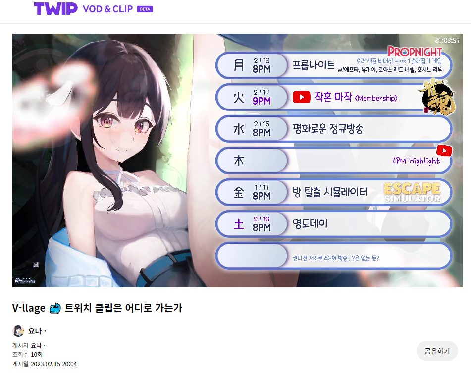

# TWIP VOD & CLIP

## 개요

{% embed url="https://support.twip.kr/hc/ko/articles/15564822836761-TWIP-VOD-CLIP-BETA-%EC%B6%9C%EC%8B%9C-%EC%95%88%EB%82%B4" %}
TWIP VOD & CLIP 베타 출시 공지


<figure><figcaption>
다시보기 시청 페이지 캡쳐
</figcaption></figure>

트위치 라이브 스트리밍 다시보기를 녹화해주는 서비스 'TWIP VOD & CLIP'

* 기간 : 2023년 1월 \~ 2023년 2월
* 회사 : 이제이엔
* 담당 범위 : 프론트엔드 일부, 백엔드 전체

## 주요 기술 스택

### Frontend

* Next.js
* Mantine UI
* Tailwind CSS
* Recoil

### Backend

* NestJS
* Sequelize
* MariaDB, Redis
* Cloudflare Stream
* ffmpeg

## 상세 개발 과정

### 배경

기존에 팀 단위 사이드 프로젝트로 [clippy.md](../side/clippy.md "mention") 프로젝트를 운영 중이었습니다. 서비스가 커지면서 비용부담이 커지기 시작했고, 이에 회사로 프로덕트를 들여오는 논의를 시작했습니다. Clippy 서비스는 클립 위주의 서비스였지만, 서비스 통합 논의가 진행된 사업부에서는 다시보기 위주의 서비스를 희망했습니다. 이에 기존에 Clippy에서 사용하던 Cloudflare Stream을 활용하여 다시보기 프로덕트로 피봇하는 쪽으로 결정을 내렸습니다.

다만 프로덕트를 회사 내부로 가져오는 과정 속에서 몇몇 이슈들이 발생하였고 (자세한 내용은 Clippy 문서에서), Clippy 서비스 종료와 TWIP VOD & CLIP 서비스 출시를 동시에 진행하는 방향으로 계획이 잡혔습니다.

### 베타 서비스 오픈 - PoC 진행

기본적으로 회사에서 진행하는 주요 로드맵 프로젝트에 포함되지 않았기 때문에 업무 외 시간을 주로 이용해서 작업을 진행했습니다. 회사 내 프론트엔드 개발자 한 분이 도와주셔서, 그 분 주도로 프론트 구조개선과 트윕 서비스로의 전환 과정이 이뤄졌습니다. 다만 백엔드와 Cloudflare쪽 컨택 등 다른 작업들은 모두 제가 맡아서 진행했습니다.

약 한달여간의 추가개발 및 오픈준비와 함께 2월 중순경 TWIP VOD & CLIP 서비스를 베타로 오픈했습니다.

### Cloudflare Stream 서비스에서의 이슈 지속적 발생

TWIP VOD & CLIP 서비스는 Cloudflare Stream이라는 스트리밍 서비스를 적극적으로 활용 중이었습니다. Cloudflare가 제공하는 RTMP 서버와 secret key를 스트리머에게 제공하고, 스트리머는 Cloudflare 서버쪽으로 방송을 진행합니다. 그러면 Cloudflare가 트위치로 재송출하고, 이 과정에서 중간에 남은 다시보기 영상을 취하는 방식입니다.

그런데 Cloudflare Stream 서비스가 예상보다 안정적으로 동작하지 않았고, 생방송 송출이 끊기거나 다운로드가 잘 안되는 등 문제가 많았습니다. 이런 이유로 다운로드가 안되는 영상의 보관기간을 늘리는 등 필요한 조치를 취하다보니 예상보다 비용이 많이 발생하였습니다.

종합적인 검토 결과 비용, CS 인입건수, 개발인력 등 문제로 다시보기 서비스는 점진적으로 축소&종료하고, 기존 Clippy처럼 클립 위주의 서비스로 다시 방향을 틀게 됩니다. 이후 [twip-clip.md](twip-clip.md "mention") 서비스로 리뉴얼되었습니다.

## 성과

* TWIP 유료 구독서비스 'TWIP Pro' 서비스 단기 무료체험유저가 출시 이전 대비 300% 이상 증가
* TWIP 유료 구독서비스 'TWIP Pro' 서비스 정기 구독자수가 출시 이전 대비 23% 증가
* 정기구독으로의 전환율은 다소 낮으나, TWIP Pro에서 제공하는 다른 기능들도 체험하며 서비스 종료 이후에도 출시 이전 대비 높은 가입자수 유지 중
