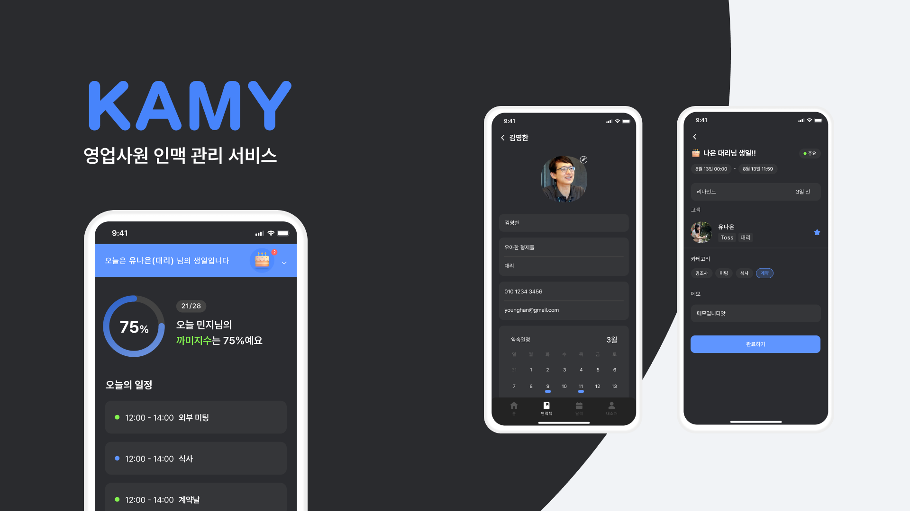
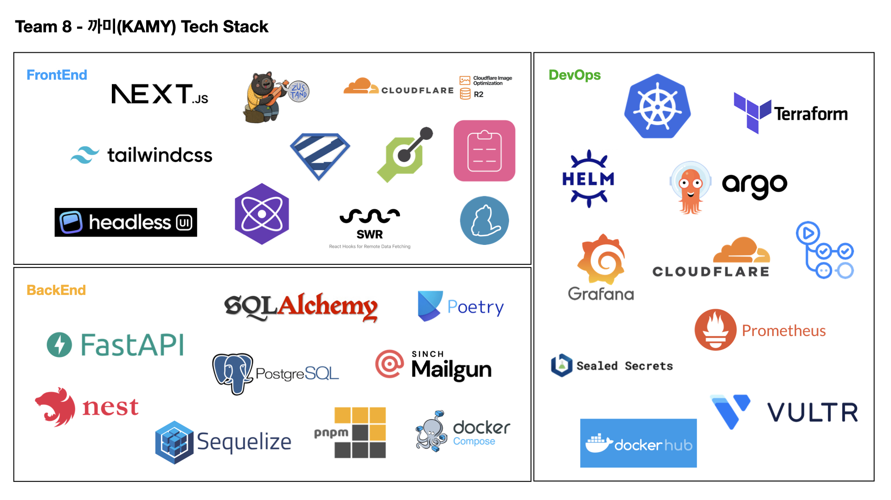

# KAMY (2023.09)

## 개요


KAMY (front.haenu.dev)



Swagger UI (api.haenu.dev/docs)


<figure><figcaption>
프로젝트 커버 이미지
</figcaption></figure>

## 기술스택

<figure><figcaption>
Project Tech Stack
</figcaption></figure>

## 세부 개발 과정

### 내가 맡았던 부분

* DevOps 전체
* Backend NestJS 파트 전체 (Cronjob)
* Backend FastAPI 파트 인증부분 (Google OAuth)

### DevOps 관련 블로그 포스팅



## 성장 포인트

* 이정도로 빠르게 효과적으로 인프라를 구성한 적은 처음이었는데, 쿠버네티스와 그 생태계에 대한 이해도가 한층 높아졌습니다. 또한 소규모 프로젝트에 DevOps 방법론이 결합되면 그 시너지 효과가 굉장히 크다는 걸 느꼈습니다.
* NestJS Standalone 모드를 처음으로 사용해보았는데 Cronjob과 같은 Batch 스타일의 작업을 위한 용도로 사용하기 적합하다고 느꼈습니다.
* FastAPI를 가볍게 사용해본 적은 많았지만, 실제 실무에서 사용하시는 분과 같은 팀을 이루며 FastAPI를 이용한 백엔드 아키텍쳐 설계, Sqlalchemy ORM 체험, Alembic을 통한 DB 버전 관리까지 다양한 새로운 경험을 할 수 있어서 좋았습니다.
