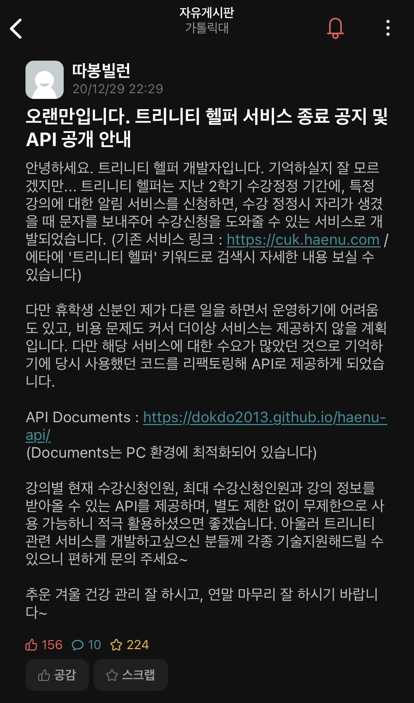

# 트리니티 헬퍼 (2020.08)

## 개요


트리니티 헬퍼



GitHub (Web)



수강신청 인원조회 API 문서 (서비스 종료 이후 공개)


가톨릭대학교 수강정정기간에 '수강신청 취소' 등 사유로 자리가 생기면 미리 신청해둔 전화번호로 문자메시지를 전송해주는 서비스.

에브리타임을 통해 홍보했으며, 대학교 익명커뮤니티의 한계를 뛰어넘고 1500명의 유저에게 서비스를 제공하였습니다. 자퇴로 인해 이후 추가로 서비스를 운영하지 못했으나, 당시 만들었던 코드와 API를 모두 공개하여 다른 학우들이 활용할 수 있도록 여러 지원을 제공하였습니다.

<figure><figcaption>
출시 안내 글
</figcaption></figure>

<figure><figcaption>
업데이트 안내 글
</figcaption></figure>

<figure><figcaption>
최종 서비스 종료 공지 및 API 공개
</figcaption></figure>

## 기술스택

* 코어 : Python (수강신청 API 호출 모듈, 문자메시지 전송 모듈), NHN Cloud (문자 전송)
* 웹 : PHP, MySQL, Bootstrap, jQuery
* 서버 : 스마일서브 iwinv 클라우드, AWS Lambda & API Gateway

## 내부 구조

먼저 대학교 포털을 개발자도구로 까서 '강의별 총 신청인원과 현재 신청인원'을 불러올 수 있는 API 엔드포인트를 땄습니다. 그 다음 파이썬으로 해당 엔드포인트를 호출할 수 있도록 코드를 짜서 이를 AWS Lambda에 올리고, API Gateway를 붙입니다. 이를 통해 자연스럽게 IP Rotate가 일어나게 만들어 많은 Request로 인한 차단이 발생하지 않도록 하였습니다.

웹에서는 최초 전화번호 인증(문자메시지)을 거쳐서 확인하고 싶은 강의를 등록할 수 있게 하였습니다. (5개 제한) 그러면 등록된 강의를 주기적인 Lambda 호출로 확인하다, 만일 자리가 생기면 등록된 전화번호로 문자메시지를 전송합니다.

이 때는 iwinv 클라우드를 사용했는데, 생각보다 서버 부하가 커서 코어 모듈 구동용으로 여러 대를 사용하며 비용이 꽤 나오게 되었습니다.

## 운영 결과

운영 기간 : 2020년 8월 14일 \~ 9월 4일 (22일간)

### 이용 통계

* 트리니티 헬퍼 웹사이트 통계 (GA 기준)
  * 총 방문자 수 : 1,532명
  * 총 페이지뷰 : 28,563회
* 트리니티 헬퍼 문자전송 서비스 통계
  * 문자전송 신청 건수 : 3,415건
  * 문자 발송 건수 : 24,823건

### 수익/지출 내역

* 수익 (후원금) : 총 105,834원
  * 카카오톡 후원 : 12건 / 49,333원
  * 은행계좌 후원 : 8건 / 56,501원
* 지출내역 : 총 335,892원
  * 문자 발송 (NHN Cloud API, 건당 9.9원, VAT 별도) : 24823 \* 9.9 \* 1.1 = 270,322원
  * iwinv 클라우드 서버 (문자전송 서버) : 서버 8대 (사양 상이), 일할계산 총 24일분 = 65,570원
  * 기타 서버, 도메인 비용 등은 기존 보유 자원 이용했으므로 비용 산출에서 제외

